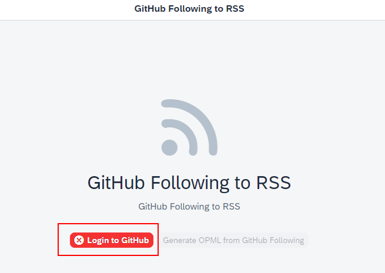
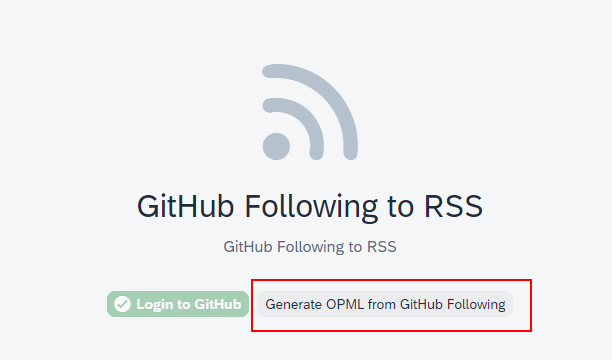
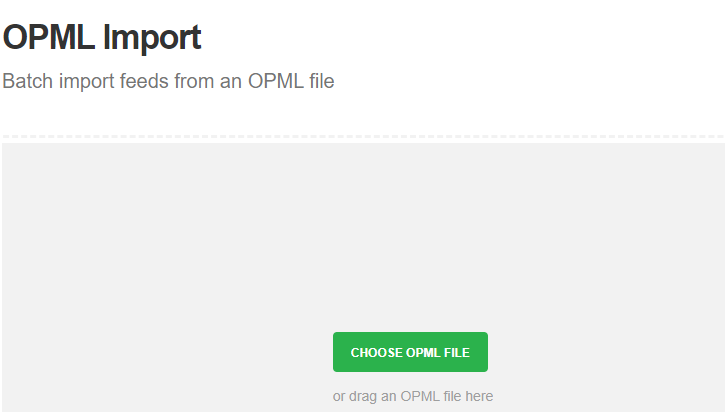

# GitHub Following to RSS Feeds

This app was generated with the [UI5 Typescript Generator](https://github.com/ui5-community/generator-ui5-ts-app).

# Concept

RSS technology continues to be an excellent one for staying up to date from a variety of sources.  
GitHub also offers an RSS feed in various areas.  
Among other things, for each user and his actions (comments, commit, create issues, create PR).  
Simply add ".atom" to the end of the user profile.  
For example, for my profile it would be "https://github.com/marianfoo.atom".

So that you don't have to do this manually, this app simply reads the GitHub Following from your profile and creates an OPML file from it.

# How To

1. Login to GitHub via OAuth

2. Generate the OPML File

3. Upload file to Feedly(or any other service). visit https://feedly.com/i/cortex

# Privacy

No backend server to save your token or any other data.  
Authentication is with GitHub OAuth and via Firebase.  
 

## License

This project is licensed under the Apache Software License, version 2.0 except as noted otherwise in the [LICENSE](LICENSE) file.
