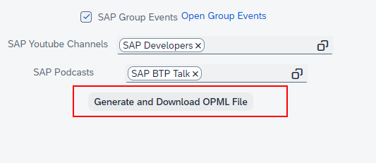

# SAP RSS Feeds Generator

This app was generated with the [UI5 Typescript Generator](https://github.com/ui5-community/generator-ui5-ts-app).

# Concept

RSS technology continues to be an excellent one for staying up to date from a variety of sources.  
GitHub also offers an RSS feed in various areas.  
Among other things, for each user and his actions (comments, commit, create issues, create PR).  
Simply add ".atom" to the end of the user profile.  
For example, for my profile it would be "https://github.com/marianfoo.atom".

So that you don't have to do this manually, this app simply reads the GitHub Following from your profile and creates an OPML file from it.

Also SAP offers a lot of RSS Feeds.  
This tool allows you to easily keep track of all the latest news, updates, and content from the SAP community. With this tool, you can:

Gather RSS feeds from a variety of sources, including:

- SAP Community Following
- SAP Blog Tags
- SAP Groups
- SAP Group Events
- SAP Youtube Channels
- SAP Podcasts

# How To

1. Choose your Categories

2. Generate the OPML File

3. Upload file to Feedly(or any other service). visit https://feedly.com/i/cortex

# Categories

## 1. GitHub Username

Just enter your GitHub Username and press "Load GitHub Data".  
It will load all your following as RSS Feeds.
## 2. SAP Community Username

Just enter your SAP Community Username and press "Load SAP Data".  
It will load all your following as RSS Feeds.

## 3. SAP Blog Tags

Just choose your favourite SAP Blog Tags.  
For every tag it will create a RSS Feed for all Blogs.

## 4. SAP Groups

Just choose your favourite Groups.  
You can choose your either blogs or community discussions.

## 5. SAP Group Events

This RSS Feeds is for all SAP Group Events.

## 6. SAP Youtube Channels

These Channels are the highest subbed Youtube Channels.

## 7. SAP Podcasts

These are all the SAP Podcast from https://podcast.opensap.info/

# Privacy

No backend server to save your token or any other data.  

## License

This project is licensed under the Apache Software License, version 2.0 except as noted otherwise in the [LICENSE](LICENSE) file.
